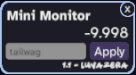

# VNyan Mini Monitor Tool

Just a small tool to display a parameter value. Mainly made for convenience when creating and testing graphs to quickly check expected values without having to open the full monitor. This will also update every frame, faster than the full monitor window.

Put whatever parameter name you want and press apply.
